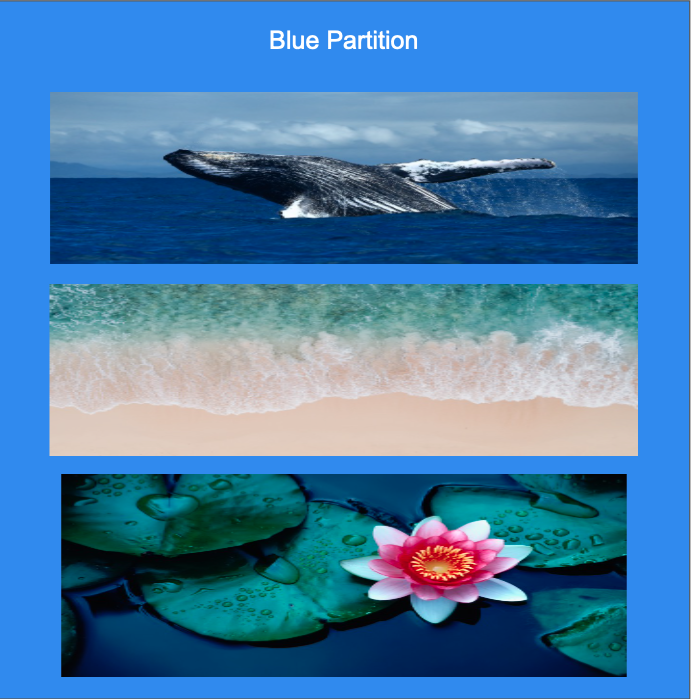

# README for the BlueCloud Metadata Enhancement Project

The main purpose of this is to add useful contextual sample metadata for ENA samples at EMBL-EBI.
This is  additional sample metadata to that which the submitter provided.  

The metadata will be added to the contextual portal rather than amending the archived copy for data integrity etc. reasons.

## GPS coordinates and Shapefiles

In ENA over 1/3 of million samples have GPS coordinates for latitude and longitude, this is 17% of all ENA samples.

Most of the marine samples have GPS coordinates for latitude and longitude. The marine community has curated hundreds of polygons of geographic and political zones usually using the same coordinate system. These polygons are grouped into shapefiles e.g. World_EEZ_v11_20191118/eez_v11.shp for the exclusive economic zones. These shapes files normally have much useful metadata about the polygons.

The GPS coordinates can be rapidly searched against the polygons and mapped to the polygon metadata. By searching a range of shapefile consensus and overlapping information can be obtained

### Polygon Searching

The computational geometry that underlies the polygon searching with coordinates is now straight forwards thanks to decades of work in the field by many people. Here we are using GDAL (C++) via GEOPANDAS https://geopandas.org/en/stable/docs/user_guide/data_structures.html . It can search 1/3 million coordinates against about hundred polygon shapefile in less than 20 seconds on my laptop, which is rather impressive.

## Additionally marine and terrestrial/freshwater samples can be determined by organism taxonomy too 

The metagenome information for marine and freshwater organisms was prepared. This is merged in with metadata above.

The shape and taxonomic information do broadly agree, but there are many points of analysis needed. It is complementary.

## Sample Types

### Marine samples
Samples from the sea, estuaries and other coastal feature were a key focus.

### Fresh water samples
Currently, there are limited polygons in shapefiles to determine if a sample is freshwater.
* The hydroshed and wetland shapefiles have the most coverage, but it has to determine which locations are actually freshwater. 
* Large freshwater bodies, be them lakes, reservoirs and rivers are well covered too. 
* Smaller rivers, lakes/ponds and rivers can be determined by distance to centre lines. Although we have been getting lowet 

### Land samples
These are low in the priority list for this project, but we have gathered much metadata in the course of the marine and fresh water metadata. 

### The Blue Partition
A key deliverable for the BlueCloud is the Blue Partition: samples that are aquatic related = marine, coastal and freshwater. 
This exploratory coding is helping to lead to a production instance.

## Enhanced Sample Annotation

The GPS coordinates and Shapefiles provide a reliable way of getting enhanced metadata.
Shapefiles for EEZ(exclusive economic zones) and other political boundaries are very useful. This metadata will be associated with the samples via the Clearing House.

## Script documentation
[a relative link](docs/script_documentation.md)

## Contributors
* Main author so far: Peter Woollard
* Marine Domain expert and taxonomy details: Stéphane Pesant
* Some technical ideas and work: Josie Burgin, Suran Jayathilaka and Lili Meszaros
