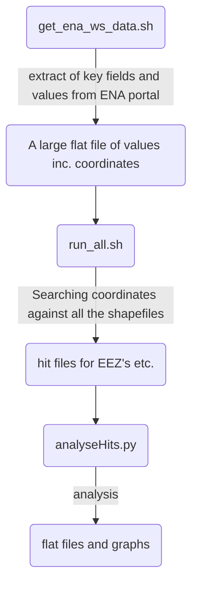
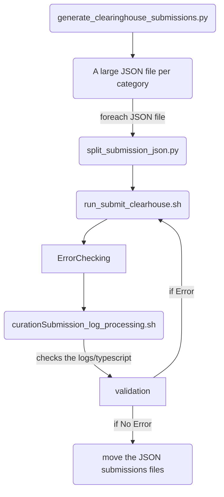
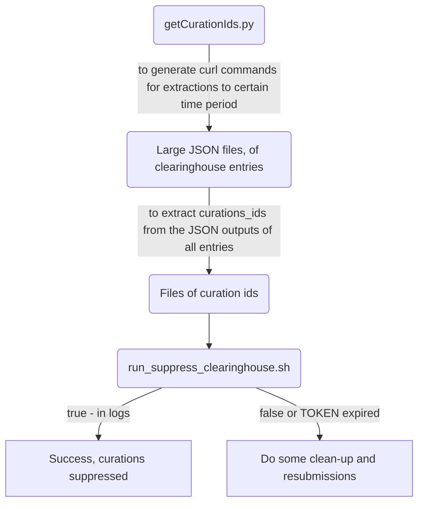
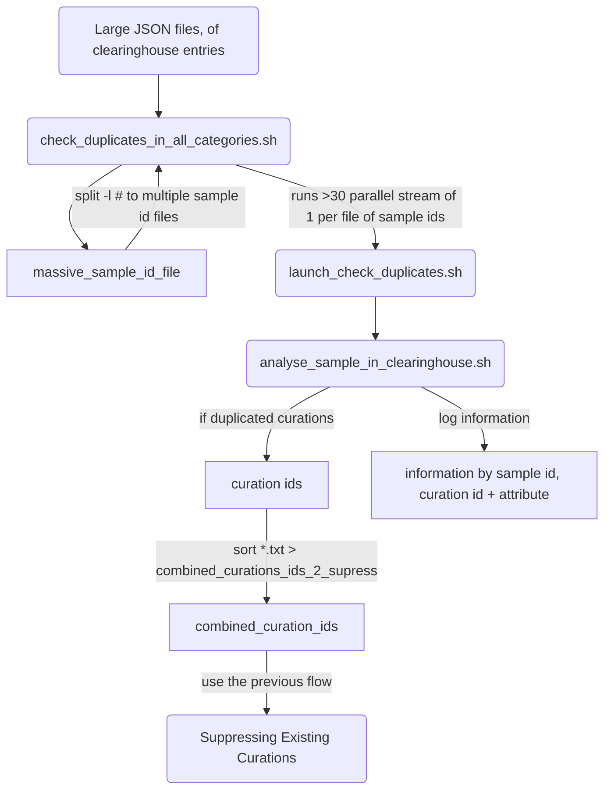

# High Level Script Documentation

Table of contents:
<!-- TOC -->
* [High Level Script Documentation](#high-level-script-documentation)
  * [Philosophy](#philosophy)
  * [Table of documentation, the high level docs from pydocs for each script](#table-of-documentation-the-high-level-docs-from-pydocs-for-each-script-)
  * [To have new versions of ena_data including new lat and longs](#to-have-new-versions-of-ena_data-including-new-lat-and-longs)
    * [Flow: Mining ENA and working out Marine/Terrestrial etc.](#flow-mining-ena-and-working-out-marineterrestrial-etc)
  * [To Generate and Submit Information to the ClearingHouse](#to-generate-and-submit-information-to-the-clearinghouse)
    * [Flow: Generating and Submitting Curations](#flow-generating-and-submitting-curations)
  * [Suppressing Existing Curations in the ClearingHouse](#suppressing-existing-curations-in-the-clearinghouse)
    * [Flow: Suppressing Existing Curations](#flow-suppressing-existing-curations)
  * [Finding Duplicated Curations that can then be suppressed as above](#finding-duplicated-curations-that-can-then-be-suppressed-as-above)
    * [Flow: Finding Duplicated Curations](#flow-finding-duplicated-curations)
  * [General notes about the scripts](#general-notes-about-the-scripts)
<!-- TOC -->

***

## Philosophy
Smaller scripts/utilities focused on different aspects 
* get ENA sample data
* run latitude and longitude points against shapefiles to generate hit files
  * multiple shapefiles each with specific attributes
  * some "category" overlaps, e.g. four different ones inform on 
* analysis scripts to merge and combine the above attributes
*  a script to read files generated above to create formatted metadata for submission to the clearinghouse.

These scripts were also used to explore the data and space, hence there were dead-end, thus deprecated scripts and functions, sorry.

## Table of documentation, the high level docs from pydocs for each script 
| Script                                       | Language | Description                                                                                                                                                                                                                                                                                                      |
|----------------------------------------------|----------|------------------------------------------------------------------------------------------------------------------------------------------------------------------------------------------------------------------------------------------------------------------------------------------------------------------|
| analyseHits.py                               | python   | Script to merge, analyse and plot the hits from getGeoLocationCategorisation.py directories for the hits, samples, analysis, plot etc. are set in "def get_directory_paths" The hits and plot files are additionally manually copied to a google drive shared with Stephane and Josie.                           |
| analysis_count_stats.py                      | python   | Script of analysis_count_stats.py is to analysis the combined output count file from the waterTaxonomyAnalysis.py It is doing some basic stats and comparisons.                                                                                                                                                  |
| categorise_environment.py                    | python   | a set of functions to do high level mappings of the rather variable environment_biome.         The main one to use is:     - process_environment_biome(df)                                                                                                                                                       |
| clearinghouse_objects.py                     | python   | clearinghouse_objects.py  are curation objects used by generate_clearinghouse_submissions.py see the PDF details in https://www.ebi.ac.uk/ena/clearinghouse/api/                                                                                                                                                 |
| convertCSV2parquet.py                        | python   | script to convert tab separated files to parquet format                                                                                                                                                                                                                                                          |
| ena_samples.py                               | python   | a bunch of ena_sample related methods  - get_all_ena_detailed_sample_info  - get_ena_species_count  - get_ena_species_info                                                                                                                                                                                       |
| find_all_gps_samples.py                      | python   | Script to do quick search of ena data warehouse for all samples with GEO locations NOT USED                                                                                                                                                                                                                      |
| generate_clearinghouse_submissions.py        | python   | generating submission JSON from merge of shape hit files and also from waterTaxonomyAnalysis.p       see the PDF details in https://www.ebi.ac.uk/ena/clearinghouse/api/                                                                                                                                         |
| extra_comparisons.py                         | python   | comparisons(venn) and other plots of the combined_designation                                                                                                                                                                                                                                                    |
| getGeoLocationCategorisation.py              | python   | Script to get the e.g. EEZ classification for a set of longitude and latitude coordinates  is using GDAL via geopandas                                                                                                                                                                                           |
| get_directory_paths.py                       | python   | takes a base directory, checks this exists              also sets the directory paths for analysis and plots etc. and checks that these all exist                                                                                                                                                                |
| parseTrawl.py                                | python   | Script to extra long and lat coordinates from sample xml     this has start and end coords                                                                                                                                                                                                                       |
| project_utils.py                             | python   | some utilities needed in several projects                                                                                                                                                                                                                                                                        |
| split_submission_json.py                     | python   | split large Clearinghouse submission JSON files with records into smaller chunks                                                                                                                                                                                                                                 |
| waterTaxonomyAnalysis.py                     | python   | Script to take the taxonomy environment assignments    and combine them with the output from analyseHits.py    to allow one to get analysis of what is marine or terrestrial/freshwater from different methods                                                                                                   |
| general_analysis.sh                          | bash     | script to get answers to questions best done with bash e.g. latitude and longitude granularity, as panda converts numbers                                                                                                                                                                                        |
| get_ena_ws_data.sh                           | bash     | script to run ENA web services to get the data for much of the analysis #The data is returned as TSV files in the "sample_dir"                                                                                                                                                                                   |
| run_all.sh                                   | bash     | script to run the lat lon coordinates against various shapefiles, using geopandas - the script automatically re-projects if different coordinate reference systems(CRS) are used. # it returns a file one row per coordinate. Additionally annotation from the shapefile is only added if a hit else nowt (NaN). |
| run_submit_clearhouse.sh                     | bash     | script to submit curation submissions jsons to the clearinghouse                                                                                                                                                                                                                                                 |
| empty_clearinghouse_submission_template.json | json     | empty_clearinghouse_submission_template                                                                                                                                                                                                                                                                          |

## To have new versions of ena_data including new lat and longs
Get the latest data from the ENA portal by running  
* get_ena_ws_data.sh 
Run the coordinates against all the shapefiles
* run_all.sh 
and in parallel get the biome regex's all run
* rm $analysis_dir/environment_biome.pickle
* ./categorise_environment.py  

Then run these scripts
* /analyseHits.py
* ./waterTaxonomyAnalysis.py
* ./extra_comparisons.py 

### Flow: Mining ENA and working out Marine/Terrestrial etc.

## To Generate and Submit Information to the ClearingHouse
See each script for detailed help 
* generate_clearinghouse_submissions.py
* split_submission_json.py - split a curation submission JSON file into batches, e.g. of 100 curations 
* run_submit_clearhouse.sh — script to curation submission JSON files to the clearinghouse

### Flow: Generating and Submitting Curations

## Suppressing Existing Curations in the ClearingHouse
Can't delete records in the ClearingHouse, but they can be suppressed.

### Flow: Suppressing Existing Curations

## Finding Duplicated Curations that can then be suppressed as above
Found that I had duplicated many curations. ClearingHouse should not allow one to have done that, but it had, (reported it, and it has since been fixed).

### Flow: Finding Duplicated Curations

   
## General notes about the scripts
Many of the scripts, e.g. get_directory_paths.py are utility scripts.

Are a mix of python and bash scripts.  Would prefer for it to be a pure python, but it was easier working with bash where environmental values and bearer files were needed etc. Plus hard to replicate what Curl and pipelining of jq was doing.
If these are to be used more in production, will probably need porting to python.